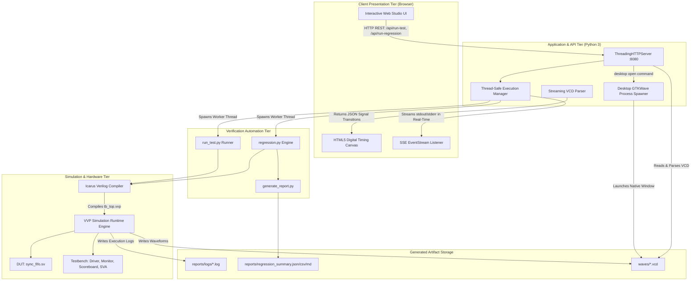
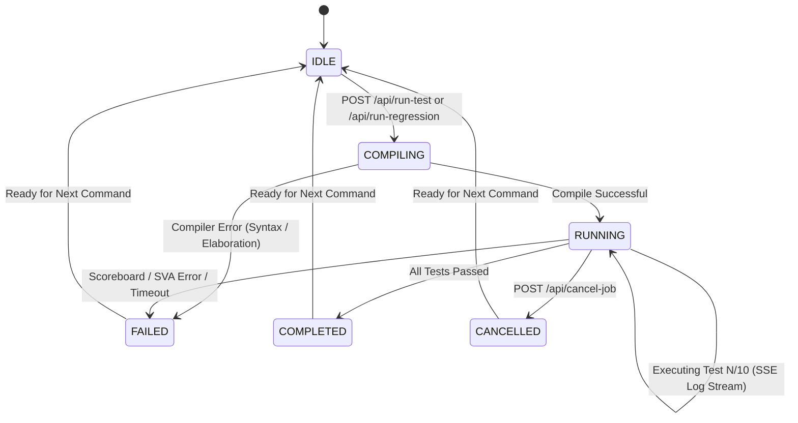

# System Architecture & Verification Methodology

An in-depth technical reference for the **RTL Verification & Automated Regression Studio**, detailing the integration between the web control surface, backend REST services, regression automation engine, and SystemVerilog verification environment.

---

## 1. End-to-End System Hierarchy

The framework integrates digital hardware simulation with modern software architecture to provide a seamless, dashboard-driven verification environment:

---

## 2. Component Responsibilities

### 2.1 Presentation Tier (`dashboard/`)
- **`index.html`**: Semantic single-page application structure organized into 8 functional operational panels: Overview, Test Catalog, Regression Suite, Waveform Debugger, Log Inspector, Reports & Data, Defect Lab, and System Health.
- **`css/style.css`**: Professional EDA Dark Mode theme with high-contrast signal coloring, glassmorphic cards, status badges, and responsive CSS grid.
- **`js/app.js`**: Client-side state manager. Orchestrates REST requests, handles Server-Sent Events (`EventSource`), dynamic table rendering, toast alerts, and modal dialogs.
- **`js/waveform_viewer.js`**: Zero-dependency 2D HTML5 Canvas rendering engine. Converts parsed VCD transition datasets into standard EDA digital waveform traces with zoom, horizontal panning, bit transitions, hex bus ribbons, and click-to-measure cursors.

### 2.2 Backend & Service Tier (`scripts/dashboard_server.py`)
- **`ThreadingHTTPServer`**: Multi-threaded HTTP server utilizing purely Python 3 standard library (`http.server`, `socket`, `threading`, `json`). Requires zero `pip` dependencies.
- **`ExecutionManager`**: Thread-safe mutex-locked controller (`threading.Lock`) managing background job execution, status reporting, process cancellation, and live log buffer queuing.
- **VCD Waveform Parser**: Streaming text parser extracting symbol definitions, wire/reg widths, timescales, and value transitions without loading redundant memory.
- **GTKWave Desktop Launcher**: Cross-platform process spawner detecting local `gtkwave` installations across `/opt/homebrew/bin`, `/usr/local/bin`, and `/Applications/gtkwave.app`.

### 2.3 Verification Automation Tier (`scripts/`)
- **`run_test.py`**: Dispatches single tests to `iverilog` and `vvp`. Passes runtime plusargs (`+TESTNAME=`, `+SEED=`, `+DUMP_WAVE=`), monitors simulation output, enforces timeouts, checks scoreboard pass/fail signatures, and returns deterministic exit codes.
- **`regression.py`**: Batch regression manager. Compiles the testbench once and executes all 10 verification scenarios. Aggregates per-test durations, data mismatches, assertion failures, and outputs summary reports.
- **`generate_report.py`**: Standalone artifact parser transforming raw simulation logs into machine-readable JSON/CSV and formatted Markdown summaries.

### 2.4 Simulation & RTL Tier (`rtl/`, `tb/`, `tests/`)
- **`rtl/sync_fifo.sv`**: Parameterized Synchronous FIFO (Data Width: 8, Depth: 16) with circular write/read pointers, fill counter, threshold comparators (`almost_full`, `almost_empty`), error flag generation (`overflow`, `underflow`), and compile-time defect injection hooks.
- **`tb/fifo_driver.sv`**: Cycle-accurate stimulus driver handling reset, single writes, single reads, continuous bursts, and simultaneous read/write cycles.
- **`tb/fifo_monitor.sv`**: Passive bus monitor sampling accepted writes and valid reads on `posedge clk` and pushing transactions to the scoreboard.
- **`tb/fifo_scoreboard.sv`**: Golden reference model maintaining an independent reference queue (`logic [7:0] ref_queue[$]`). Performs cycle-accurate data matching and fill tracking.
- **`tb/fifo_assertions.sv`**: SystemVerilog Assertions (SVA) checking safety invariants (`!(full && empty)`, `count <= DEPTH`, `overflow` on full write, `underflow` on empty read).
- **`tb/tb_top.sv`**: Top-level testbench harness generating 100MHz clock, reset, 50,000-cycle watchdog timer, and plusarg test dispatcher.

---

## 3. Communication & REST API Interfaces

The backend exposes a strictly defined REST API with input sanitization and zero arbitrary shell execution:

| Method | Endpoint | Description | Request Body / Params | Response Format |
| :--- | :--- | :--- | :--- | :--- |
| `GET` | `/api/status` | System health, tool paths, active job status | None | JSON (`system`, `project`, `job`) |
| `GET` | `/api/tests` | Discovered test catalog with metadata | None | JSON (`tests: [...]`, `total`) |
| `GET` | `/api/job-status` | Current simulation job progress & log stream | None | JSON (`status`, `progress_pct`, `log_stream`) |
| `GET` | `/api/job-stream` | Real-time Server-Sent Events (SSE) log stream | None | `text/event-stream` chunks |
| `GET` | `/api/reports/latest` | Latest regression summary JSON | None | JSON (`summary`, `test_results`) |
| `GET` | `/api/reports/file` | Download summary file | `?format=json\|csv\|md` | File stream / text |
| `GET` | `/api/logs/<test>` | Retrieve raw simulation log for specific test | None | Plaintext / JSON |
| `GET` | `/api/waves/parse` | Parse VCD file into digital waveform transitions | `?test=<test_name>` | JSON (`signals: [...]`, `max_time`) |
| `GET` | `/api/defects` | List available defect injection macros | None | JSON (`defects: {...}`) |
| `POST` | `/api/run-test` | Trigger single test execution | `{"test_name", "seed", "wave", "bug_macro"}` | JSON (`status: "STARTED"`) |
| `POST` | `/api/run-regression`| Trigger full 10-test regression | `{"seed", "wave"}` | JSON (`status: "STARTED"`) |
| `POST` | `/api/defect-demo/run`| Launch 3-stage defect injection experiment | `{"defect_macro": "BUG_INJECT_..."}` | JSON (`status: "STARTED"`) |
| `POST` | `/api/cancel-job` | Abort active simulation process | None | JSON (`message: "Aborted"`) |
| `POST` | `/api/waves/open` | Launch native desktop GTKWave viewer | `{"test_name": "<test>"}` | JSON (`message: "Launched"`) |
| `POST` | `/api/workspace/clean`| Clean build binaries and old logs | None | JSON (`message: "Cleaned"`) |

---

## 4. Process Lifecycle & State Machine

---

## 5. Security Architecture & Process Safety

Because the application interacts with the local operating system to compile and execute simulation binaries, the following security constraints are enforced:

1. **No Arbitrary Command Injection**:
   - The web frontend does not possess any endpoint to execute arbitrary shell commands.
   - All subprocess invocations use discrete array arguments (e.g. `subprocess.run(["iverilog", "-g2012", ...])`) rather than `shell=True`.
2. **Input Sanitization & Allowlisting**:
   - `test_name` is strictly validated against the regular expression `^[a-zA-Z0-9_]+$` and verified to match an existing file in `tests/`.
   - `bug_macro` is strictly validated against `VALID_BUG_MACROS`. Any unlisted macro is rejected with HTTP 400 Bad Request.
3. **Network Isolation**:
   - The server binds strictly to the IPv4 loopback interface (`127.0.0.1`), preventing exposure to external networks or local LAN peers.
4. **Watchdog Timer & Resource Protection**:
   - Top-level SystemVerilog harness enforces a 50,000-cycle hardware watchdog timer.
   - Python runner enforces a 30-second subprocess timeout to prevent orphan or runaway processes.
