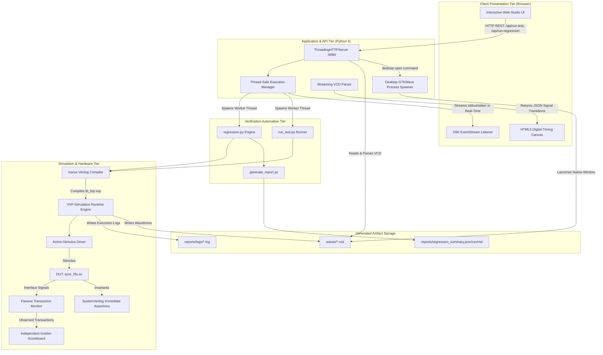

# System Architecture & Verification Methodology

An in-depth technical reference for the **RTL Verification & Automated Regression Studio**, detailing the integration between the web control surface, backend REST services, regression automation engine, and SystemVerilog verification environment.

---

## 1. End-to-End System Hierarchy

The framework integrates digital hardware simulation with modern software architecture to provide a seamless, dashboard-driven verification environment:



---

## 2. Component Responsibilities

### 2.1 Verification Data Path Architecture
To ensure rigorous, unbiased verification, the testbench enforces strict separation of concerns across active and passive components:

```
Driver  (Drives stimulus on negedge clk)
   ↓
  DUT   (Updates registers on posedge clk)
   ↓
Monitor (Passively samples interface on posedge clk, qualifies valid transactions)
   ↓
Scoreboard (Compares actual monitored data vs golden queue model, verifies flags)
   ↓
PASS/FAIL ($fatal(1) if any scoreboard mismatch, SVA failure, or logged error)
```

1. **Active Stimulus Driver (`tb/fifo_driver.sv`)**:
   - Drives interface pins (`rst_n`, `wr_en`, `wr_data`, `rd_en`) synchronously to `@(negedge clk)` so that signals are stable ahead of setup times on rising clock edges.
   - Has zero access to the scoreboard reference model or expected outcomes.
2. **Passive Monitor (`tb/fifo_monitor.sv`)**:
   - Observes DUT interface signals passively on `@(posedge clk)`.
   - Pre-samples boundary flags (`full_sample`, `empty_sample`) to accurately qualify whether transactions were accepted by the DUT.
   - Forwards accepted writes (`wr_data`) and valid reads (`rd_data`) directly to `tb_top.scoreboard`.
   - Forwards observed status flags (`full`, `empty`, `almost_full`, `almost_empty`, `count`) to the scoreboard for state checking.
3. **Independent Golden Scoreboard (`tb/fifo_scoreboard.sv`)**:
   - Maintains an independent golden reference queue (`logic [DATA_WIDTH-1:0] ref_queue[$]`).
   - Compares dequeued actual data against expected golden data word-by-word.
   - Independently calculates expected fill level and status flags from `ref_queue.size()`.
   - Any mismatch increments error counters (`mismatched_reads`, `flag_errors`).
4. **SystemVerilog Assertions (`tb/fifo_assertions.sv`)**:
   - Implements 10 SystemVerilog Immediate Assertions (`assert (...) else $error(...)`) evaluating invariant properties on `@(posedge clk)`.
   - Evaluates reset states, full/empty mutual exclusion, count bounds, flag invariants, and error protocol pulse timing.
5. **Top Harness (`tb/tb_top.sv`)**:
   - Wires clock generator (100MHz), reset generator, 50,000-cycle watchdog timer, and plusargs dispatcher.
   - Evaluates total test errors at completion:
     `total_test_errors = scoreboard.get_total_errors() + assertions.get_assertion_failures() + fifo_pkg::get_pkg_error_count();`
   - Terminates with `$finish(0)` on pass or `$fatal(1)` on any error.

### 2.2 Application & Service Tier (`scripts/dashboard_server.py`)
- **`ThreadingHTTPServer`**: Multi-threaded HTTP server utilizing purely Python 3 standard library (`http.server`, `socket`, `threading`, `json`). Requires zero `pip` dependencies.
- **`ExecutionManager`**: Thread-safe controller managing background job execution, status reporting, process cancellation, and live log buffer queuing.
- **VCD Waveform Parser**: Streaming text parser extracting symbol definitions, wire/reg widths, timescales, and value transitions into JSON timing diagrams.
- **GTKWave Desktop Launcher**: Cross-platform process spawner detecting local `gtkwave` installations across `/opt/homebrew/bin`, `/usr/local/bin`, and `/Applications/gtkwave.app`.

### 2.3 Verification Automation Tier (`scripts/`)
- **`run_test.py`**: Dispatches single tests to `iverilog` and `vvp`. Passes runtime plusargs (`+TESTNAME=`, `+SEED=`, `+DUMP_WAVE=`), monitors simulation output, enforces timeouts, checks scoreboard pass/fail signatures, and returns deterministic exit codes.
- **`regression.py`**: Batch regression manager. Compiles the testbench once and executes all 10 verification scenarios. Supports `--demo-defect` mode for headless 3-stage defect lifecycle verification.
- **`generate_report.py`**: Standalone artifact parser transforming raw simulation logs into machine-readable JSON/CSV and formatted Markdown summaries.

---

## 3. Communication & REST API Interfaces

The backend exposes a strictly defined REST API with input sanitization and zero arbitrary shell execution:

| Method | Endpoint | Description | Request Body / Params | Response Format |
| :--- | :--- | :--- | :--- | :--- |
| `GET` | `/api/status` | System health, tool paths, active job status | None | JSON (`system`, `project`, `job`) |
| `GET` | `/api/tests` | Discovered test catalog with metadata | None | JSON (`tests: [...]`, `total`) |
| `GET` | `/api/job-status` | Current simulation job progress & log stream | None | JSON (`status`, `progress_pct`, `log_stream`) |
| `GET` | `/api/job-stream` | Real-time Server-Sent Events (SSE) log stream | None | `text/event-stream` chunks |
| `GET` | `/api/reports/latest` | Latest regression summary JSON | None | JSON (`summary`, `test_results`) |
| `GET` | `/api/reports/file` | Download summary file | `?format=json\|csv\|md` | File stream / text |
| `GET` | `/api/logs/<test>` | Retrieve raw simulation log for specific test | None | Plaintext / JSON |
| `GET` | `/api/waves/parse` | Parse VCD file into digital waveform transitions | `?test=<test_name>` | JSON (`signals: [...]`, `max_time`) |
| `GET` | `/api/defects` | List available defect injection macros | None | JSON (`defects: {...}`) |
| `POST` | `/api/run-test` | Trigger single test execution | `{"test_name", "seed", "wave", "bug_macro"}` | JSON (`status: "STARTED"`) |
| `POST` | `/api/run-regression`| Trigger full 10-test regression | `{"seed", "wave"}` | JSON (`status: "STARTED"`) |
| `POST` | `/api/defect-demo/run`| Launch validated 3-stage defect injection experiment | `{"defect_macro": "BUG_INJECT_..."}` | JSON (`status: "STARTED"`) |
| `POST` | `/api/cancel-job` | Abort active simulation process | None | JSON (`message: "Aborted"`) |
| `POST` | `/api/waves/open` | Launch native desktop GTKWave viewer | `{"test_name": "<test>"}` | JSON (`message: "Launched"`) |
| `POST` | `/api/workspace/clean`| Clean build binaries and old logs | None | JSON (`message: "Cleaned"`) |

---

## 4. Validated Defect-Injection Lifecycle

The defect demonstration follows a deterministic 3-stage state machine that validates actual simulation outcomes:

```
[STAGE 1: DEFECT INJECTION]
Compile RTL with `+define+<BUG_MACRO>`
Run regression suite
VALIDATION CHECK:
- Did regression fail?
- Did the expected test detector fail?
IF NO -> Mark DEMO FAILED and abort!
IF YES -> Proceed to Stage 2.
       ↓
[STAGE 2: RESTORE CLEAN BASELINE]
Compile clean golden RTL (`sync_fifo.sv`)
       ↓
[STAGE 3: CLEAN VERIFICATION PASS]
Run regression on golden RTL
VALIDATION CHECK:
- Did all 10 tests pass?
- Were zero errors reported?
IF NO -> Mark DEMO FAILED!
IF YES -> Mark STAGE_3_VERIFIED!
```

---

## 5. Security Architecture & Process Safety

Because the application interacts with the local operating system to compile and execute simulation binaries, the following security constraints are enforced:

1. **No Arbitrary Command Injection**:
   - The web frontend does not possess any endpoint to execute arbitrary shell commands.
   - All subprocess invocations use discrete array arguments (e.g. `subprocess.run(["iverilog", "-g2012", ...])`) rather than `shell=True`.
2. **Input Sanitization & Allowlisting**:
   - `test_name` is strictly validated against the regular expression `^[a-zA-Z0-9_]+$` and verified to match an existing file in `tests/`.
   - `bug_macro` is strictly validated against `VALID_BUG_MACROS`. Any unlisted macro is rejected with HTTP 400 Bad Request.
3. **Network Isolation**:
   - The server binds strictly to the IPv4 loopback interface (`127.0.0.1`), preventing exposure to external networks or local LAN peers.
4. **Watchdog Timer & Resource Protection**:
   - Top-level SystemVerilog harness enforces a 50,000-cycle hardware watchdog timer.
   - Python runner enforces a 30-second subprocess timeout to prevent orphan or runaway processes.
